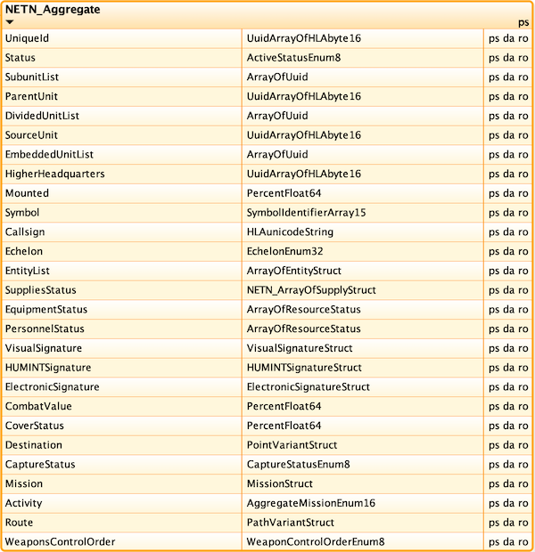
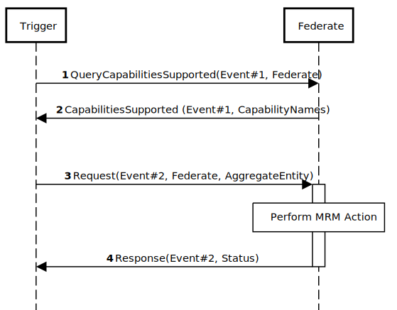
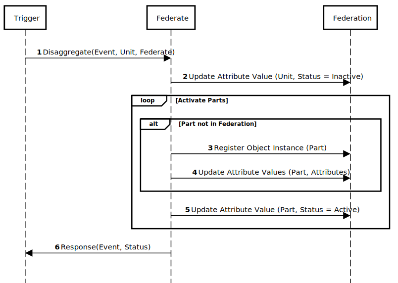
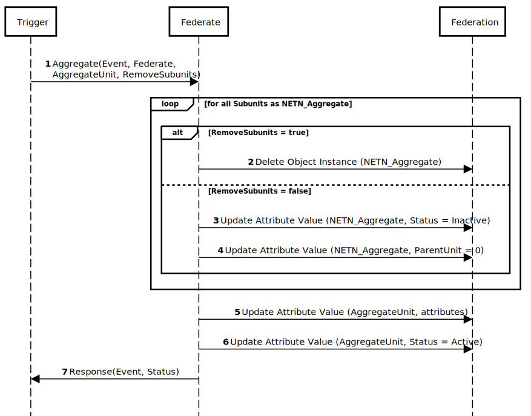
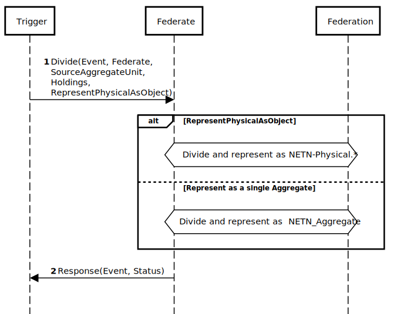
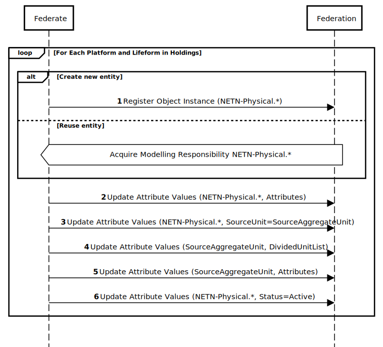
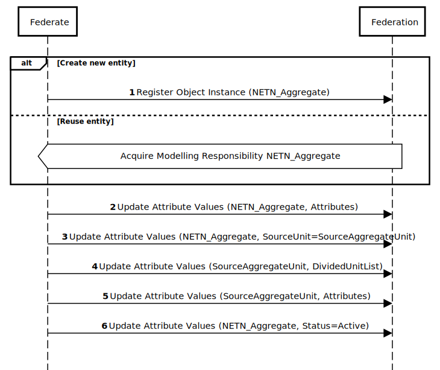
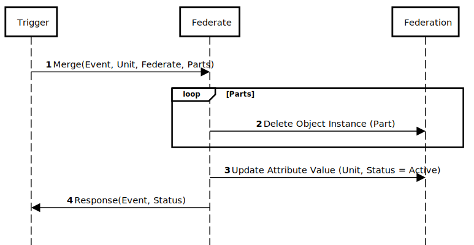

# NETN-MRM

Copyright (C) 2020 NATO/OTAN.
This work is licensed under a [Creative Commons Attribution-NoDerivatives 4.0 International License](LICENCE.md).

## Introduction

Models of real-world objects, processes and phenomena are used to create a synthetic representation suitable for simulation. Depending on the purpose and requirements of the simulation, the models can have different levels of resolution and aggregation can be used to create representations of larger combined concepts. 

The NATO Education and Training Network Multi-Resolution Modelling (NETN-MRM) FOM Module is a specification of how to perform aggregation and disaggregation of aggregated representation of entities, e.g. units, into other levels of aggregation or individual entities, e.g. platforms, in a federated distributed simulation. 

The specification is based on IEEE 1516 High Level Architecture (HLA) Object Model Template (OMT) and primarily intended to support interoperability in a federated simulation (federation) based on HLA. A Federation Object Model (FOM) Module is used to specify how data is represented and exchanged in the federation. The NETN-MRM FOM module is available as an XML file for use in HLA based federations.

### Purpose

The purpose of NETN-MRM is to support federations where models are represented at multiple levels of resolution and where the level of resolution can change dynamically during a simulation.

For example:
* Disaggregation of a Battalion represented as a `NETN_Aggregate` object into Company level `NETN_Aggregate` objects.
* Disaggregation of a Company level unit, represented as a `NETN_Aggregate` object, to individual platforms e.g. `NETN_GroundVehicle` objects.
* Aggregation of platforms represented as, e.g. `NETN_GroundVehicle` objects, to an attribute of a unit e.g. a Platoon, represented as a `NETN_Aggregate` object.
* Dividing individual equipment, e.g. UAV, from a Company unit to simulate some reconnaissance operation in more detail.
* Merging of a Recce platoon, represented as a `NETN_Aggregate` object, on its return from a mission with its source Company unit. 

### Scope

NETN-MRM covers the following cases:

* Aggregation of simulated subunits and/or physical entities.
* Disaggregation of a unit into subunits and/or physical entities.
* Division of simulated unit where resources are allocated between source unit and divided unit.
* Division of simulated unit where equipment resources are removed from source unit and instead represented as physical entities.
* Merging of previously divided entities with source unit.
* Activation or Inactivation of entities represented in the simulation.

### Dependencies

The NETN-MRM refers to simulated entities by UUID as defined in NETN-Aggregate and NETN-Physical. Implementation of Aggregation, Disaggregation and Divide also requires a knowledge of the structure and organization of units and allocation of equipment. Information contained in NETN-Aggregate, NETN-Physical, and indirectly in NETN-ORG, can be used to produce aggregation and disaggregation results. 

In the MRM patterns, the acquisition of modelling responsibility of simulated entities may use NETN-TMR.

## Overview

NETN-MRM requires the use of NETN-Aggregate and NETN-Physical Object Classes for the aggregate representation units and physical entities in the simulation.

A unit can be represented in the simulation in various ways.

* Not explicitly registered in the federation as a simulated object but represented in scenario data such as NETN-ORG `Unit` objects or similar.

* Registered as an actively simulated `NETN_Aggregate` object. The state of the unit is explicitly simulated by federates in the distributed federated simulation.

* Registered as an inactive `NETN_Aggregate` object. The state of the unit is not explicitly simulated but derived from the simulation of its subunits and/or physical entities. 

* Registered as divided with a reduced source `NETN_Aggregate` object and  subsets of the divided resources modeled as `NETN_Aggregate` or NETN-Physical objects. The resources of the source unit are split between the simulated entities when divided.

Figure: NETN_Aggregate object class as an extension of RPR-FOM

A `NETN_Aggregate` object is a representation of an organizational unit including all equipment, personnel and supplies allocated to subunits. The `NETN_Aggregate` object representing a unit can be disaggregated into subunits each represented as a `NETN_Aggregate` object. Aggregrate representation of units can also be divided and the unit represented as multiple `NETN_Aggregate` objects and/or physical entities.

Disaggregation of a unit always constitutes a full disaggregation of all subunits into active `NETN_Aggregate` objects. The aggregated unit itself can remain registered in the federation as an inactive `NETN_Aggregate` object and its state can be updated based on the simulation of its disaggregated subunits.

Aggregation of a unit always constitutes a full aggregation of all subunits into an active `NETN_Aggregate` object. The disaggregated units can remain registered in the federation as an inactive `NETN_Aggregate` object and its state can be updated based on the simulation of its aggregated parent.

Division of a unit is a temporary allocation of specific resources from a source (original unit) represented as an active `NETN_Aggregate` object. The specified resources are contained and represented in the federation as an additional active `NETN_Aggregate` object or as individual physical entities representing specific equipment. 

Merging of a previously divided unit will incorporate `NETN_Aggregate` object(s) and physical entities back to its source `NETN_Aggregate` object.

MRM events can be requested and triggered using HLA interactions defined in the NETN-MRM FOM Module. All events are directed to a federate responsible for managing the MRM event. The result of an MRM event is reported to the requesting/triggering federate using a `Response` interaction.

Figure: MRM interactions and events

The capability of a federate to support MRM events for a specific aggregate unit can be queried using the `QuerySupportedCapabilities` interaction. The response is provided using `CapabilitiesSupported` interaction and includes a list of names of available MRM events.

## NETN_Aggregate

The `NETN_Aggregate` object class is a specialization/subclass of the RPR-FOM object class `BaseEntity.AggregateEntity` and defines additional attributes.

|Attribute|Description|
|---|---|
|UniqueId|**Required:** A unique identifier for the object. The Universally Unique Identifier (UUID) is either generated or defined as part of part of scenario initialization, e.g. using NETN-ORG MSDL data. The unique identifier can serve dual purposes. It is a unique identification of the NETN_Aggregate object instance but can also be seen as a reference to a NETN-ORG unit element with the same unique identifier.|
|Status|**Required:** Indicate if this aggregate unit currently is being simulated or not. E.g. units mounted or embarked on transports can be set to inactive. During inactive state the attribute values may not reflect an accurate current value. Therefore, any subscribing federate can ignore inactive units. All attributes must be updated to represent the current status of the instance before status is set to Active.|
|SubunitList|**Optional:** Reference to disaggregated representations of subsets of the aggregate unit when registered in the federation. Each element should refer to an existing NETN_Aggregate object in the federation. If not published, disaggregation is not supported.|
|ParentUnit|**Optional:** Reference to parent aggregate entity. If not published, aggregation is not supported. Default value is 0000000000000000 (no parent unit).|
|DividedUnitList|**Optional:** Reference to other aggregate or physical entities divided from the aggregate unit to represent specific subsets of holdings. If not published, division is not supported.|
|SourceUnit|**Optional:** Reference to another active NETN_Aggregate instance from which this aggregate was divided. If not published, merging is not supported.|
|EmbeddedUnitList|**Optional:** A list referencing units and/or platforms embarked on and transported by this unit. If not published, transport of embedded units not supported.|
|HigherHeadquarters|**Optional:** A reference to an entity representing the aggregate unit's superior or headquarters from which orders are given and to which reports are sent. The highest level unit or headquarters will publish 0000000000000000 as its HigherHeadquarters value. The referenced entity may or may not be registered in the federation as a NETN_Aggregate and/or NETN-ORG unit. If not published, the aggregate does not have superior unit or headquarter. Default value is 0000000000000000 (no higher headquarters).|
|Mounted|**Optional:** The percentage of aggregate personnel travelling on or in their organic transport. Default 100% - all personnel mounted.|
|Symbol|**Required:** The APP-6 (C) / MIL-STD 2525 (C) symbol code for the aggregate unit. |
|Callsign|**Required:**  A callsign used to address the unit. Callsigns should be unique in the context in which they are used but not required to be globally unique.|
|Echelon|**Optional:** The size of the unit (level of command).|
|EntityList|**Optional:** This attribute provides data on all entities comprising the aggregate. Entities includes equipment, e.g. platfoms, weapons, sensors and lifeforms such as personnel. Each entity contain key status attributes and subunit allocation information. If not provided the status and allocation of entities is not modelled on an entity level.|
|SuppliesStatus|**Optional:** The type and quantities of supplies available (on hand) to the unit. If not provided the amount of available supplies is undefined.|
|EquipmentStatus|**Optional:** This summarizes the health status of the equipment comprising the aggregate. If not provided, the status of equipment is undefined.|
|PersonnelStatus|**Optional:** This summarizes the health status of personnel comprising the aggregate. If not provided, the status of personnel is undefined.|
|VisualSignature|**Optional:** Describes the unit's susceptibility to electro-optical detection.|
|HUMINTSignature|**Optional:** Describes the unit's susceptibility to human intelligence (HUMINT), i.e. information collected and provided by human sources.|
|ElectronicSignature|**Optional:** Describes the aggregate's susceptibility to electronic detection both as a summary value and by identifying aggregate sensors together with their operational status.|
|CombatValue|**Optional:** A summary value (in percent) of unit effectiveness based on level of training, leadership, moral, personnel and equipment operational status, etc.|
|CoverStatus|**Optional:** Describes the unit's protection from the effects of weapons fire. Default is 0% - Fully affected by weapon fire.|
|CaptureStatus|**Optional:** The status of a person or unit with respect to their control or influence over their own activities. Default: 1 - Not Captured.|
|Mission|**Optional:** The operational task the aggregate has been ordered to perform.|
|Activity|**Optional:** The current activity of the aggregate. This may differ from the mission due to casualties, readiness, etc.|
|Route|**Optional:** The current path of movement. |
|Destination|**Optional:** The current destination of movement. |
|WeaponsControlOrder|**Optional:** Describes current Weapon Control Order Free, Tight, or Hold. Default is 0 - Other.|

### Specific use of inherited attributes

| Attribute| Note|
|---|---|
|AggregateState|**Required:** Only the following values are used: `Aggregated`, `Disaggregated`, or `Fully Disaggregated`. When `Fully Disaggregated` the `Status` should be set to `Inactive`.|
|Dimensions|**Required:**|
|EntityIdentifiers|**Inherited:**|
|IsPartOf|**Inherited:** Used when mounted or transported by other Aggregate entity|
|SubAggregatesIdentifiers|**Inherited:** Reference to `NETN_Aggregate` object instances registered in the federation representing subunits.|
|SilentAggregates|**Inherited:** |
|SilentEntities|**Inherited:** |

## MRM actions

All MRM actions use the same pattern of interaction. 
1. A triggering federate requests a specified federate to perform an action on a specified aggregate entity using subclasses of interaction `Request`
2. If possible, the action is performed.
3. The success of the requested action is reported using the interaction  `Response`

Before sending a more specific MRM request to a federate, the MRM capabilities supported by the federate may be queried. To query which MRM actions are supported, a `QueryCapabilitiesSupported` request interaction may be sent. All federates implementing NETN-MRM must implement support for `QueryCapabilitiesSupported` and provide a `CapabilitiesSupported` response interaction. If a federates is not responding to `QueryCapabilitiesSupported` it should be assumed not to support any MRM action. A federate not supporting a specific MRM action should never be requested such action.

<!--
participant Trigger
participant Federate
autonumber 
Trigger->Federate:QueryCapabilitiesSupported(Event#1, Federate)

Federate->Trigger:CapabilitiesSupported (Event#1, CapabilityNames)

space

Trigger->Federate:Request(Event#2, Federate, AggregateUnit)

activate Federate

box left of Federate:Perform MRM Action
Trigger<-Federate:Response(Event#2, Status)

deactivate Federate

autonumber off
-->

Figure: Query and Request of MRM actions

### Request
|Attribute|Description|
|---|---|
|Federate|**Required:** Intended federate responsible for performing the requested action. Sending federate should ensure that receiving federate has the capability to perform requested action. If not able to perform, a response interaction indicating failure should be returned. |
|AggregateUnit|**Required for all requests except QuerySupportedCapabilities:** Unique identifier for the AggregateUnit for which this request is related to. |

### Response
|Attribute|Description|
|---|---|
|Status|**Required:** Specifies the result of the request action. TRUE indicates success.|

### CapabilitiesSupported
|Attribute|Description|
|---|---|
|CapabilityNames|**Required:** A list of names of the supported capabilities for the Aggregate entity specified in the query. The names are one or more of "Aggregate", "Disaggregate", "Divide", "Merge", "Activate" and "Inactivate".|

### Disaggregate

*Conditions*

* Disaggregation is only allowed for an aggregate unit registered in the federation as a non-divided and active `NETN_Aggregate` object. 
* The federate performing disaggregation must be able to acquire modelling responsibility of the `Status` attribute of the `NETN_Aggregate` object representing the aggregated unit. 
* The federate performing disaggregation must be able to acquire modelling responsibility of the `Status` attribute of `NETN_Aggregate` objects representing the aggregated unit's subunits.  

A `Response` interaction with `Status` parameter set to `FALSE` should be sent if any of these conditions is not met.

<!--
participant Trigger
participant Federate
participant Federation
autonumber 
Trigger->Federate:Disaggregate(Event, Federate, \nAggregateUnit)

Federate->Federation:Update Attribute Value (AggregateUnit, Status = Inactive)

loop Activate Subunits

alt Create new NETN_Aggregate
Federate->Federation:Register Object Instance (NETN_Aggregate)
else Reuse existing NETN_Aggregate
aboxleft over Federate, Federation:Acquire Modelling Responsibility NETN_Aggregate
end

Federation<-Federate:Update Attribute Values (NETN_Aggregate, Attributes)
Federation<-Federate:Update Attribute Values (NETN_Aggregate, ParentUnit=AggregateUnit)

Federation<-Federate:Update Attribute Value (NETN_Aggregate, Status = Active)
end
Federation<-Federate:Update Attribute Values (AggregateUnit, SubunitList)
Trigger<-Federate:Response(Event, Status)
autonumber off

-->
Figure: Disaggregation of a unit

1. A trigger federate sends a `Disaggregate` request to a specified `Federate` with reference to the `AggregateUnit` object representing the unit to disaggregate.
2. The receiving federate performs actions to acquire modelling responsibility of the `Status` attribute for the `NETN_Aggregate` object referenced by the `AggregateUnit` parameter. If successful the federate updates the `Status` attribute of the object instance to `Inactive`.
3. The federate registers subunits as `NETN_Aggregate` objects if not already registered in the federation. If registered, the modelling responsibility of the `Status` attribute is acquired. 
4. Initial attribute values are updated for the new `NETN_Aggregate` objects.
5. The federate updates the `ParentUnit` attribute of new `NETN_Aggregate` objects to refer to the `AggregateUnit`.
6. The federate updates the `Status` attribute of the `NETN_Aggregate` objects to `Active`.
7. The federate updates the `SubunitList` attribute of the `AggregateUnit` objects which include reference to all aggregate entities representing the subunits.
8. On completion, a `Response` interaction is sent with `Status` parameter set to indicate successful completion of the request.

### Aggregate

*Conditions*

* Aggregation is only allowed for an aggregate unit registered in the federation as an inactive `NETN_Aggregate` object. 
* The federate performing aggregation must be able to acquire modelling responsibility of the `Status` attribute of the `NETN_Aggregate` object representing the aggregated unit. 
* The federate performing aggregation must be able to either remove `NETN_Aggregate` objects representing subunits from the federation or acquire modelling responsibility of the `Status` attribute of these objects. 

A `Response` interaction with `Status` parameter set to `FALSE` should be sent if any of these conditions is not met.

<!-- 
participant Trigger
participant Federate
participant Federation
autonumber 
Trigger->Federate:Aggregate(Event, Federate, \nAggregateUnit, RemoveSubunits)

loop for all Subunits as NETN_Aggregate
alt RemoveSubunits = true
Federate->Federation:Delete Object Instance (NETN_Aggregate)

else RemoveSubunits = false
Federation<-Federate:Update Attribute Value (NETN_Aggregate, Status = Inactive)
Federation<-Federate:Update Attribute Value (NETN_Aggregate, ParentUnit = 0)
end
end

Federate->Federation:Update Attribute Value (AggregateUnit, attributes)

Federate->Federation:Update Attribute Value (AggregateUnit, Status = Active)

Trigger<-Federate:Response(Event, Status)
autonumber off
-->

Figure: Aggregation of a unit

1. A trigger federate sends a `Aggregate` request to a specified `Federate` with reference to the `AggregateUnit` object representing the unit to aggregate.
2. If indicated in the request, the federate deletes all subunits and/or physical entities registered in the federation.
3. The federates updates `Status` of all subunits, represented as `NETN_Aggregate` objects in the federation, to `Inactive` if indicated in the request that they should remain in the federation.
4. The federate updates all status attributes of the unit to reflect the aggregate state.
5. The federate updates the `Status` of the unit to `Active`.
6. On completion, a `Response` interaction is sent with `Status` parameter set to indicate successful completion of the request.
 

### Divide
*Conditions*
* The federate performing division must be able to acquire modelling responsibility of the attributes of the `NETN_Aggregate` object representing the aggregated unit. 
* Division is only allowed for non-divided aggregate units registered in the federation as active `NETN_Aggregate` objects. 

A `Response` interaction with `Status` parameter set to `FALSE` should be sent if any of these conditions is not met.

Figure: Divide an aggregate unit

<!--
participant Trigger
participant Federate
participant Federation
autonumber 
Trigger->Federate:Divide(Event, Federate, \nSourceAggregateUnit, \nHoldings, \nRepresentPhysicalAsObject)

alt RepresentPhysicalAsObject
abox over Federate, Federation:Divide and represent as NETN-Physical.*

else Represent as a single Aggregate

abox over Federate, Federation:Divide and represent as  NETN_Aggregate
end

Trigger<-Federate:Response(Event, Status)
autonumber off
-->

1. A trigger federate sends a `Divide` request to a specified `Federate` with reference to the `SourceAggregateUnit` object to divide and a list of the divided holdings. In the request, a flag indicates if each physical entities in the holdings should be registered as individual objects or not.

Divide by either acquiring or registering in the federation an additional `NETN_Aggregate` or instances of `NETN-Physical` entities for platforms and/or lifeforms. 

2. On completion, a `Response` interaction is sent with `Status` parameter set to indicate successful completion of the request.

#### Dividing to Physical Entities
If physical entities is indicated to be registered as objects, then each platform and lifeform entity in the holdings should be represented as individual objects in the federation. These objects are instances of `NETN-Physical` leaf object classes and can either be already existing or created based on the divided holdings information. 

*Conditions*

* Reuse of existing instances for representing divided holdings is only allowed if not already in use, i.e. the `SourceUnit` attribute is not published or set to all zeros.
* Reuse of existing instances for representing divided holdings requires the Federate performing division must be able to acquiring modelling responsibilities for attributes `SourceUnit` and `Status` of these instances.

If these conditions for reuse of existing entities for representing divided holdings are not met, the federate sould attempt alternate procedures or indicate failure to complete division in a `Response` interaction.

Figure: Divide an aggregate unit into physical entities.

<!--
participant Federate
participant Federation
autonumber 

loop For Each Platform and Lifeform in Holdings
alt Create new entity
Federate->Federation:Register Object Instance (NETN-Physical.*)
else Reuse entity
aboxleft over Federate, Federation:Acquire Modelling Responsibility NETN-Physical.*
end

Federation<-Federate:Update Attribute Values (NETN-Physical.*, Attributes)
Federation<-Federate:Update Attribute Values (NETN-Physical.*, SourceUnit=SourceAggregateUnit)
Federation<-Federate:Update Attribute Values (SourceAggregateUnit, DividedUnitList)
Federation<-Federate:Update Attribute Values (SourceAggregateUnit, Attributes)
Federation<-Federate:Update Attribute Values (NETN-Physical.*, Status=Active)
end

autonumber off

-->
1. If not reusing an existing object in the federation, the physical entity is registered in the federation as a corresponding `NETN-Physical` leaf class. Otherwise, acquire modelling responsibilities of the object to be reused as a representation for the physical entity.
2. The physical entity object is updated with appropriate initial attribute values.
3. The `SourceUnit` attribute of the registered physical entity is updated to reference the `SourceAggregateUnit`.
4. The attribute `DividedUnitList` of the `SourceAggregateUnit` is updated to include reference to the physical entity object.
5. The `SourceAggregateUnit` attributes are updated to reflect reduction of holdings.
6. The `Status` attribute of the physical entity object is set to `Active`.

#### Dividing to Aggregate Entities
If physical entities should not be registered as objects, then 

Figure: Subdivide an aggregate unit.

<!--
participant Federate
participant Federation
autonumber 

alt Create new entity
Federate->Federation:Register Object Instance (NETN_Aggregate)
else Reuse entity
aboxleft over Federate, Federation:Acquire Modelling Responsibility NETN_Aggregate
end

Federation<-Federate:Update Attribute Values (NETN_Aggregate, Attributes)

Federation<-Federate:Update Attribute Values (NETN_Aggregate, SourceUnit=SourceAggregateUnit)
Federation<-Federate:Update Attribute Values (SourceAggregateUnit, DividedUnitList)
Federation<-Federate:Update Attribute Values (SourceAggregateUnit, Attributes)
Federation<-Federate:Update Attribute Values (NETN_Aggregate, Status=Active)

-->

1. If not reusing an existing object in the federation, then a single `NETN_Aggregate` object is registered in the federation. Otherwise, acquire modelling responsibilities of the `NETN_Aggregate` object to be reused as a representation for the divided holdings.
9. The `NETN_Aggregate` object is updated with appropriate initial attribute values.
10. The `SourceUnit` attribute of the `NETN_Aggregate` object is updated to reference the `SourceAggregateUnit`.
11. The attribute `DividedUnitList` of the `SourceAggregateUnit` is updated to include reference to the `NETN_Aggregate` object.
12. The `SourceAggregateUnit` attributes are updated to reflect reduction of holdings.
13. The `Status` attribute of the `NETN_Aggregate` object is set to `Active`.

 
### Merge
*Conditions*
* The federate performing merge must be able to acquire modelling responsibility of the attributes of the `NETN_Aggregate` object representing the source aggregated unit. 
* The federate performing merge must be able to acquire modelling responsibility of the attributes of the divided object instances.
* Merge is only allowed for divided aggregate units registered in the federation.
* Merge is only allowed for an active `NETN_Aggregate` objects. 

A `Response` interaction with `Status` parameter set to `FALSE` should be sent if any of these conditions is not met.

Figure: Merge divided parts with their aggregate unit

<!--
participant Trigger
participant Federate
participant Federation
autonumber 
Trigger->Federate:Merge(Event, Federate, \nSourceAggregateUnit, \nDividedUnits, RemoveDivided)
loop for all DividedUnits
alt RemoveDivided = true
Federate->Federation:Delete Object Instance (DividedUnit)
else RemoveDivided = false
Federation<-Federate:Update Attribute Value (DividedUnit, Status = Inactive)
Federation<-Federate:Update Attribute Value (DividedUnit, SourceUnit = 0)
end
Federate->Federation: Update Attribute Values(SourceAggregateUnit, DividedUnitList)
Federate->Federation: Update Attribute Values(SourceAggregateUnit)
end
Trigger<-Federate:Response(Event, Status)
autonumber off
-->

1. A trigger federate sends a `Merge` request to a specified `Federate` with reference to the `SourceAggregateUnit` object and a list of the divided units to merge. In the request, a flag indicates if the divided units should remain in the federation as inactive entities or if they should be removed. 

For each divided unit:

2. Delete from the federation if indicated.
3. If the divided unit should remain, update the `Status` attribute to `Inactive`. 
4. If the divided unit should remain, update the `SourceUnit` attribute to 0 (no souce unit).
5. Update the `SourceAggregateUnit` attribute `DividedUnitList` to exclude the divided units now merged. 
6. Update the `SourceAggregateUnit` attributes to reflect the merged status.

On completion:

7. A `Response` interaction is sent with `Status` parameter set to indicate successful completion of the request.

### Activate
*Conditions*
* An `AggregateUnit` can not be activated if any subunit is active.

A `Response` interaction with `Status` parameter set to `FALSE` should be sent if this condition is not met. Otherwise, the `AggregateUnit` attribute is updated to `Active`.

### Inactivate
*Conditions*

* An `AggregateUnit` can not be inactivated if a divided unit exists.

A `Response` interaction with `Status` parameter set to `FALSE` should be sent if this condition is not met. Otherwise, the `AggregateUnit` attribute is updated to `Inactive`.
