# NETN-FOM

|Version| Date| Dependencies|
|---|---|---|
|3.0|2023-03-23|NETN-BASE, RPR-Aggregate|

The purpose of NETN-MRM is to support federations where models are represented at multiple levels of resolution and where the level of resolution can change dynamically during a simulation. 

Models of real-world objects, processes and phenomena are used to create a synthetic representation suitable for simulation. Depending on the purpose and requirements of the simulation, the models can have different levels of resolution and aggregation can be used to create representations of broader combined concepts.

The NATO Education and Training Network Multi-Resolution Modelling (NETN-MRM) FOM Module is a specification of how to perform aggregation and disaggregation of aggregated representation of entities, e.g. units, into other levels of aggregation or individual entities, e.g. platforms, in a federated distributed simulation.

The MRM FOM module specifies interaction classes necessary to enable federation multi-resolution modelling. The specification is based on IEEE 1516 High Level Architecture (HLA) Object Model Template (OMT) and is primarily intended to support interoperability in a federated simulation (federation) based on HLA. An HLA-based Federation Object Model (FOM) is used to specify types of data and their encoding on the network. The NETN-MRM FOM module is available as an XML file for use in HLA-based federations.

NETN-MRM covers the following cases:  
* Aggregation of entities representing subunits and/or physical entities 
* Disaggregation of entities representing a unit into entities representing subunits and/or physical entities 
* Division of simulated entities into parts - resources divided and all entities simulated 
* Merge of previously divided entities.

## Overview

NETN-MRM extends the RPR-FOM `AggregateEntity`, `Platform` and `Lifeform` object classes with attributes to support the representation of units and equipment. In addition, interactions are defined to request aggregation, disaggregation, division and merge actions on aggregated entities.

Implementation of aggregation, disaggregation, division and merge, requires knowledge of the structure and organisation of units and their equipment as defined in NETN-ORG.

A `Unit`, as defined in NETN-ORG, can be represented in the federation as a single `AggregateEntity` object or as a collection of multiple `AggregateEntity`, `Platform` or `Lifeform` objects. E.g. a `Unit` with associated `EquipmentItems` in NETN-ORG can be represented as a combination of an `AggregateEntity` representing most of the unit and `Platform` entities to represent each platform equipment item associated with the unit.

The initial representation of units in the federation can change during runtime. Use the MRM actions to request aggregation and disaggregation or to split the representation by dividing holdings among multiple aggregate entities, platforms or lifeforms objects.

The attribute extensions provided in NETN-MRM are defined on RPR-FOM object classes, however, a subclass for `NETN_Aggregate` is provided and can be used to allow subscribers to discover and distinguish between RPR and entended NETN objects. Similar NETN subclasses for `Platforms` and `Lifeforms` are defined in the NETN-Physical FOM module on which NETN-MRM depends.

### Pattern

All MRM actions use the same pattern of interaction. 

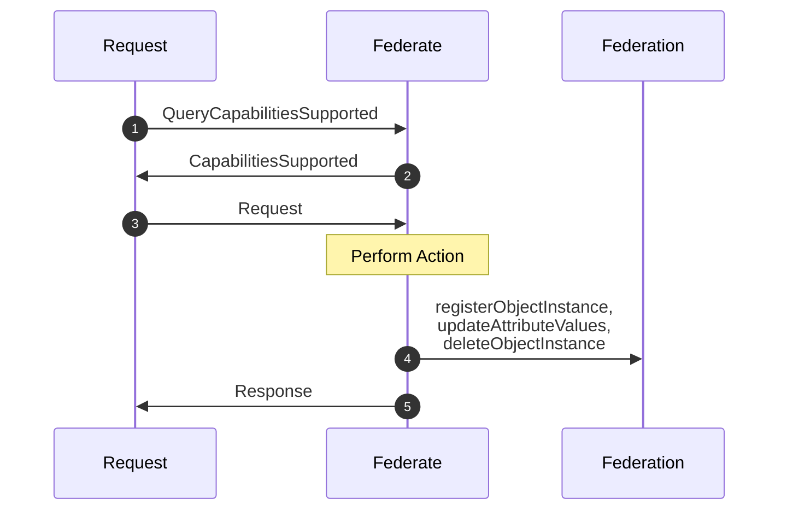

1. Before sending a more specific MRM request, the MRM capabilities supported by a federate can be queried. To query which MRM actions are supported, send a `QueryCapabilitiesSupported` request interaction. 
2. All federates implementing NETN-MRM must implement support for `QueryCapabilitiesSupported` and provide a `CapabilitiesSupported` response interaction. If a federate is not responding to `QueryCapabilitiesSupported` it should be assumed it does not support any MRM action. Once a federate respond to this query, additional queries are not required before each MRM action.
3. A federate requests an action on a specified `AggregateEntity` using subclasses of the interaction class `Request`
4. The federate owning the `DisaggregatedEntities` attribute of the `AggregateEntity` is responsible for aggregation and disaggregation actions.  The federate owning the `DividedEntities` attribute of the `AggregateEntity` is responsible for division and merging actions. Performing the action may include registering, deleting and updating objects in the federation.
5. The federate then reports the success of the action using the interaction `Response`.

### Disaggregation

Disaggregation can be performed on `AggregateEntity` objects in the federation under the following conditions:

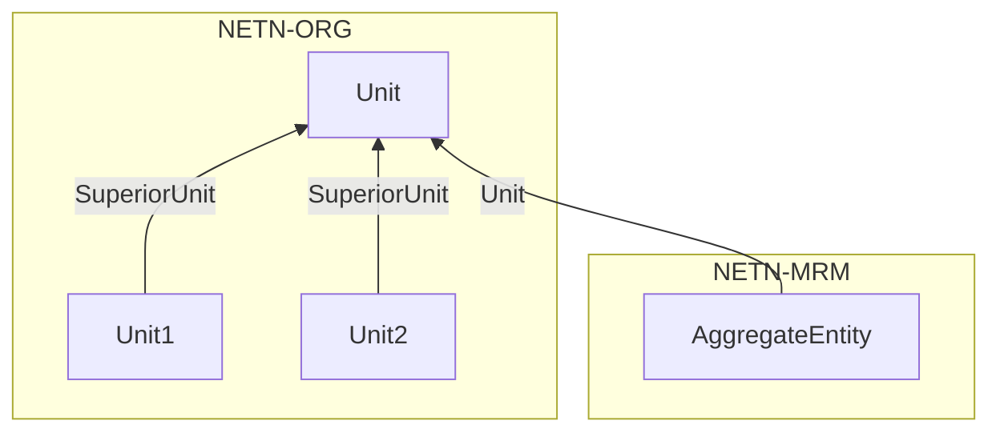

* The federate application owning the `DisaggregatedEntities` attribute of the `AggregateEntity` is capable of performing disaggregation.
* The `Status` of the `AggregateEntity` is `Active`.
* The `AggregateEntity` attribute `Unit` refers to an existing NETN-ORG `Unit` object.
* The NETN-ORG `Unit` object has one or more subunits.
* The `AggregateEntity` has not been divided, i.e. the `DividedEntities` attribute must be empty.

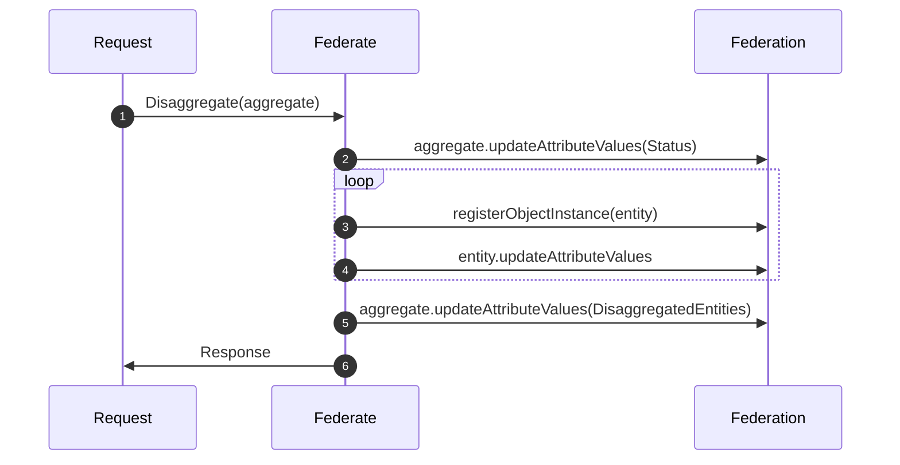

1. A Request federate sends a `Disaggregate` request indicating which `AggregateEntity` to disaggregate. The Federate owning the `DisaggregatedEntities` attribute of the `AggregateEntity` is responsible for performing the disaggregation.
2. The Federate updates the `Status` of the `AggregateEntity` to `Inactive`.
3. The Federate registers new `AggregateEntity` objects to represent the disaggregated entities. One object for each of the subunits of the referenced `Unit`.
4. The federate updates the initial attribute values for the new disaggregated entities including the `ParentUnit` attribute to refer to the  `AggregateEntity` and the `Status` to `Active`.
5. The federate updates the `DisaggregatedEntities` attribute of the `AggregateEntity` object to reference the new disaggregated entities.
6. On completion, the federate sends a `Response` interaction with the `Status` parameter set to indicate the successful completion of the request. If the conditions for disaggregation are not met the status indicates a failure to disaggregate.

After performing disaggregation the following is true:

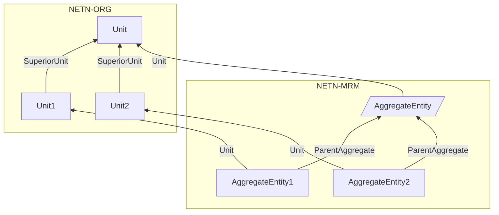

* The `Status` of the `AggregateEntity` is `Inactive`. 
* New `AggregateEntity` objects exist for all subunits of the referenced NETN-ORG `Unit`.
* Each new `AggregateEntity` refers to the corresponding subunit by its `Unit` attribute.
* The `Status` of each new `AggregateEntity` is `Active`
* The `ParentAggregate` of each new `AggregateEntity` refers to the original disaggregated `AggregateEntity`
* The `DisaggregsatedEntities` attribute of the disaggregated `AggregateEntity` reference all the new `AggregateEntity` objects

If a subunit in NETN-ORG has one or more associated `EquipmentItem` objects representing platforms, these are represented in the federation as `Platform` objects with the `EquipmentItem` attribute referring to the NETN-ORG `EquipmentItem` object. The status is set to `Active` and the `ParentAggregate` is set to the disaggregated `AggregateEntity`. 

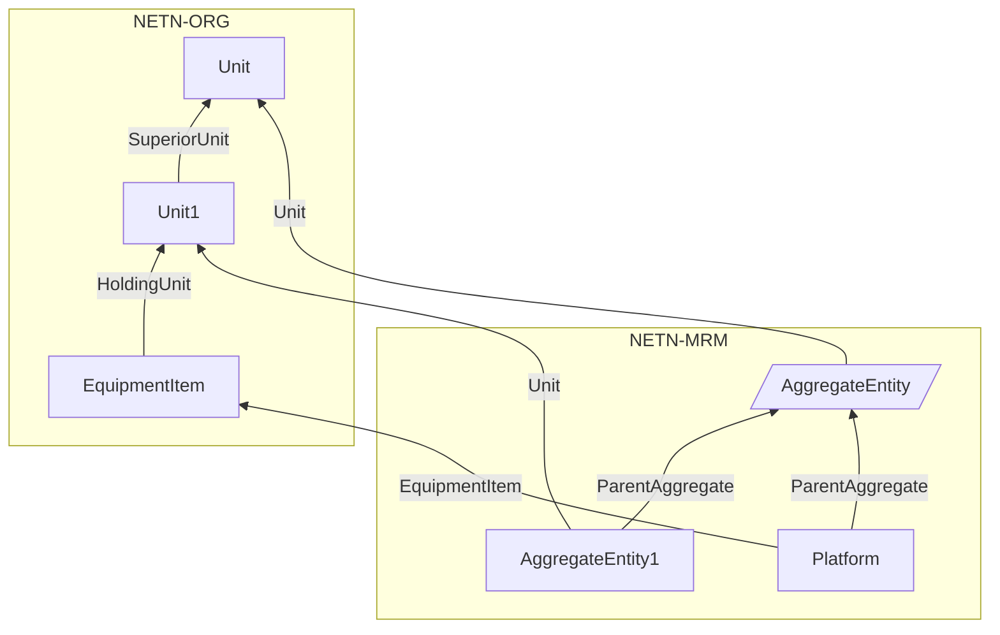

Disaggregation always constitutes a full disaggregation of all subunits and associated equipment items into active `AggregateEntity` or `Platform` objects. The disaggregated `AggregateEntity` itself remain registered in the federation as `Inactive`. 

### Aggregation

Aggregation of an `AggregateEntity` always constitutes a full aggregation of all entities referenced by the `DisaggregatedEnties` attribute. 

Aggregation can be performed on `AggregateEntity` objects in the federation under the following conditions:

* The federate application owning the `DisaggregatedEntities` attribute of the `AggregateEntity`, is capable of performing aggregation.
* The `Status` of the `AggregateEntity` is `Inctive`.
* The `DividedEntities` attribute must be empty in all `AggregateEntity` objects referenced by the `DisaggregatedEntities` attribute, i.e. entities referencing the `AggregateEntity` using the `ParentAggregate` attribute can not be divided.
* The `DisaggregatedEntities` attribute must be empty in all `AggregateEntity` objects referenced by the `DisaggregatedEntities` attribute, i.e. entities referencing the `AggregateEntity` using the `ParentAggregate` attribute can not be disaggregated.

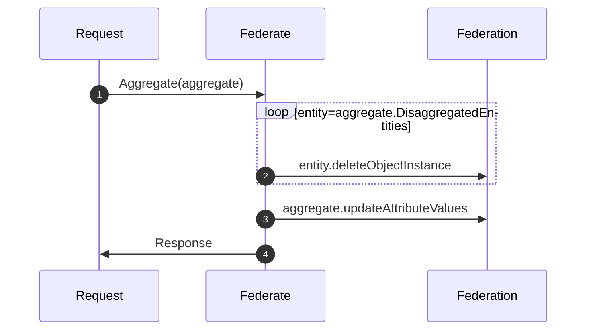

1. A Request federate sends an `Aggregate` request indicating which `AggregateEntity` to aggregate. The Federate owning the `DisaggregatedEntities` attribute of the `AggregateEntity` is responsible for performing the aggregation.
2. The federate deletes all entities referenced by the `DisaggregatedEntities` attribute
3. The federate updates all `AggregateEntity` attributes to reflect the current state including the `Status` set to `Active`.
4. On completion, the federate sends a `Response` interaction with the `Status` parameter set to indicate the successful completion of the request. If any of the conditions are false the `Status` parameter is set to `FALSE`.

### Division

Division of an `AggregateEntity` is a temporary allocation of some specific resources to another `AggregateEntity` or into one or more `Platform` and `Lifeform` objects. 

Division can be performed on `AggregateEntity` objects in the federation under the following conditions:

* The federate application owning the `DividedEntities` attribute of the `AggregateEntity`, is capable of performing division.
* The `Status` of the `AggregateEntity` is `Active`.
* The `AggregateEntity` has not been disaggregated, i.e. the `DisaggregatedEntities` attribute must be empty.

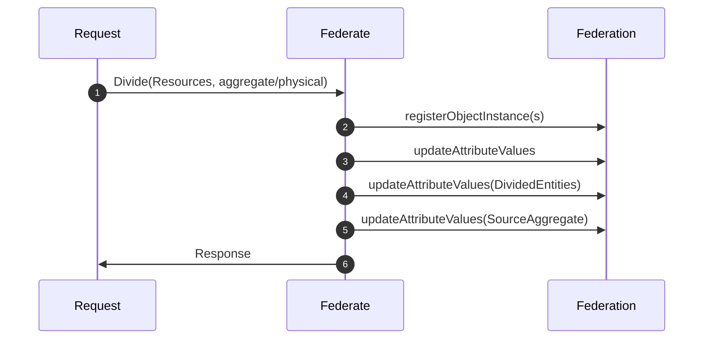

1. A Request federate sends a `Divide` interaction indicating the `AggregateEntity` to divide and the list of resources to reallocate to new entities. The request also indicates if resources should be allocated to a new `AggregateEntity` or as one or more physical `Platform` or `Lifeform` objects. The Federate owning the `DividedEntities` attribute of the `AggregateEntity` is responsible for performing the division.
2. The federate registers either a new `AggregateEntity` or one or more `Platform` or `Lifeform` objects.
3. The `AggregateEntity` and new entity are updated with the current status of allocated resources. 
4.  The `AggregateEntity` is updated with the attribute `DividedEntities` referencing all newly created entities. 
5. All newly created entities are updated with the attribute `SourceAggregate` to refer to the `AggregateEntity`
2. On completion, the federate sends a `Response` interaction with the `Status` parameter set to indicate the successful completion of the request. The federate sends the `Status` parameter set to `FALSE` if any of the conditions are false.

After division the following is true:

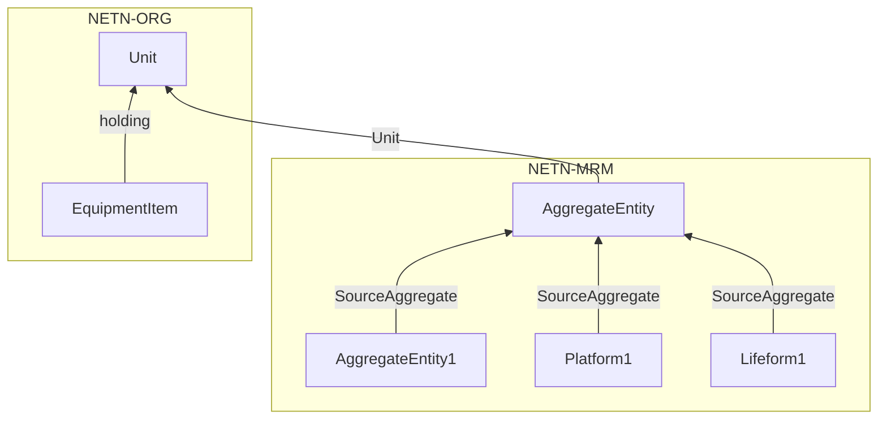

* A new `AggregateEntity` object exists with a `SourceAggregate` attribute referencing the divided `AggregateEntity`, OR
* One or more new `Platform` and `Lifeform` objects exist with `SourceAggregate`` attribute referencing the divided `AggregateEntity
* The divided `AggregateEntity` references all new divided entities in the `DividedEntities` attribute.

### Merging

Merging of an `AggregateEntity` with one of its divided entities can be performed under the following conditions:

* The federate application owning the `DividedEntities` attribute of the `AggregateEntity`, is capable of performing a merge.
* The `Status` of the `AggregateEntity` is `Active`.
* The `AggregateEntity` has been divided, i.e. the `DividedEntities` attribute must contain at least one element.
 

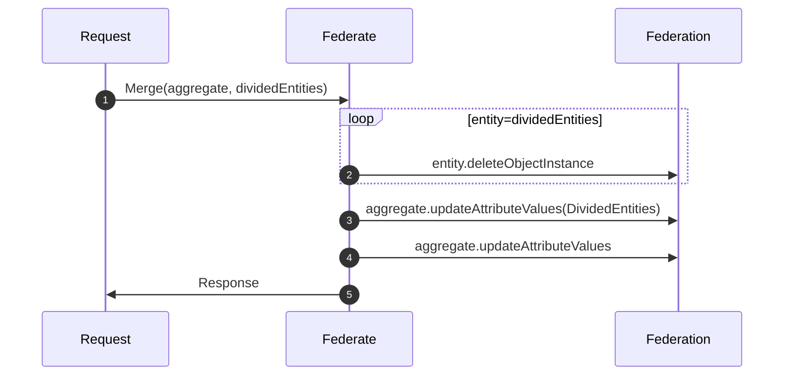

1. A Request federate sends a `Merge` interaction indicating the `AggregateEntity` and the divided entities to merge. The Federate owning the `DividedEntities` attribute of the `AggregateEntity` is responsible for performing the merge.
2. The federate deletes all divided entities to be merged with the `AggregateEntity`.
3. Update the `AggregateEntity` attribute `DividedEntities` to exclude the divided entities now merged. 
4. Update the `AggregateEntity` attributes to reflect the merged status.
5.  On completion, the federate sends a `Response` interaction with the `Status` parameter set to indicate success or failure.

After merging, all resources modelled in the previously divided entities are represented in the `AggregateEntity`

## Object Classes

Note that inherited and dependency attributes are not included in the description of object classes.

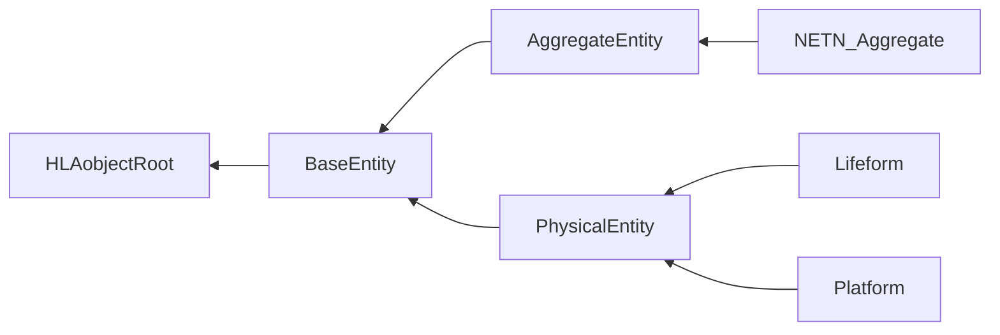

### AggregateEntity

A group of one or more separate objects that operate together as part of an organization. These objects may be discrete, may be other aggregate objects, or may be a mixture of both.

|Attribute|Datatype|Semantics|
|---|---|---|
|Callsign|HLAunicodeString|Required. A name for the entity. Callsigns should be unique in the context in which they are used but not required to be globally unique.|
|Unit|UUID|Optional: Reference to an existing NETN-ORG `Unit` object that is represented by this `AggregateEntity`. Default value is all zeros.|
|ParentAggregate|UUID|Optional. If this AggregateEntity is the result of a disaggregation, this attribute references back to the AggregateEntity that was disaggregated. The default value is all zeros.|
|DisaggregatedEntities|ArrayOfUuid|Optional. Reference to the disaggregated entities after this AggregateEntity has been disaggregated. Each element should refer to an existing entity in the federation. Status of this AggregateEntity shall be inactive if disaggregated entities exist.|
|SourceAggregate|UUID|Optional. Reference to an active NETN_Aggregate instance, the source of a NETN-MRM division. The default value is all zeros representing no source AggregateEntity.|
|DividedEntities|ArrayOfUuid|Optional. Reference to other aggregate or physical entities divided from the AggregateEntity to represent specific subsets of holdings.|
|MountedOn|MountStruct|Optional. Mounting progress and reference to the host entity.|
|MountedEntities|ArrayOfUuid|Optional. Reference to entities mounted on and transported by this AggregateEntity.|
|EntityList|ArrayOfEntityStruct|Optional. This attribute provides data on all equipment, and lifeforms associated with this AggregateEntity, e.g. platforms, weapons, sensors and personnel.|
|Destination|WorldLocationStruct|Optional. The current destination of movement.|
|Route|ArrayOfWorldLocationStruct|Optional. The current path of movement.|
|SuppliesStatus|SupplyStructArray|Optional. The type and quantities of supplies available (on hand) to the entity. If not provided, the amount of available supplies is undefined.|
|EquipmentStatus|ArrayOfResourceStatus|Optional. This summarizes the health status of the equipment comprising the aggregate. If not provided, the status of equipment is undefined.|
|PersonnelStatus|ArrayOfResourceStatus|Optional. This summarizes the health status of personnel comprising the aggregate. If not provided, the status of personnel is undefined.|
|VisualSignature|VisualSignatureStruct|Optional: Describes the susceptibility to electro-optical detection.|
|HUMINTSignature|HUMINTSignatureStruct|Optional: Describes the susceptibility to human intelligence (HUMINT), i.e. information collected and provided by human sources.|
|ElectronicSignature|ElectronicSignatureStruct|Optional: Describes the susceptibility to electronic detection both as a summary value and by identifying aggregate sensors together with their operational status.|
|CombatValue|PercentFloat32|Optional. A summary value (in percent) of the effectiveness based on the level of training, leadership, morale, personnel and equipment operational status, etc. The default value is 100%.|
|CoverStatus|PercentFloat32|Optional. Describes the entity's protection from the effects of weapons fire. Default is 0% - Fully affected by weapon fire.|
|CaptureStatus|CaptureStatusEnum8|Optional: The status of with respect to its control or influence over its own activities.|
|WeaponsControlOrder|WeaponControlOrderEnum8|Optional. Describes current Weapon Control Order Free, Tight, or Hold. Default is 0 - Other.|
|HigherHeadquarters|UUID|Optional. A reference to an entity representing the superior or headquarters from which orders can be given and to which reports are sent. The referenced entity is a NETN-ORG `Unit` object. The default value is all zeros (no higher headquarters).|
|Echelon|EchelonEnum32|Optional. The size of the AggregateEntity (level of command).|
|Mission|MissionStruct|Optional. The operational task the aggregate has been ordered to perform.|

### NETN_Aggregate

Aggregate extensions for NETN

### Lifeform

A living military platform (human or not).

|Attribute|Datatype|Semantics|
|---|---|---|
|SourceAggregate|UUID|Optional. Reference to an active `AggregateEntity` instance from which this physical entity was divided. The default value is all zeros representing no source entity.|

### Platform

A physical object under the control of armed forces upon which sensor, communication, or weapon systems may be mounted.

|Attribute|Datatype|Semantics|
|---|---|---|
|EquipmentItem|UUID|Optional: Reference to a NETN-ORG EquipmentItem that is represented by this Platform. Default value is all zeros.|
|ParentAggregate|UUID|Optional. If this Platform is the result of a disaggregation, this attribute references back to the AggregateEntity that was disaggregated. The default value is all zeros.|
|SourceAggregate|UUID|Optional. Reference to an active Aggregate instance from which this physical entity was divided. If not published, merging is not supported. The default value is all zeros representing no source entity.|

## Interaction Classes

Note that inherited and dependency parameters are not included in the description of interaction classes.

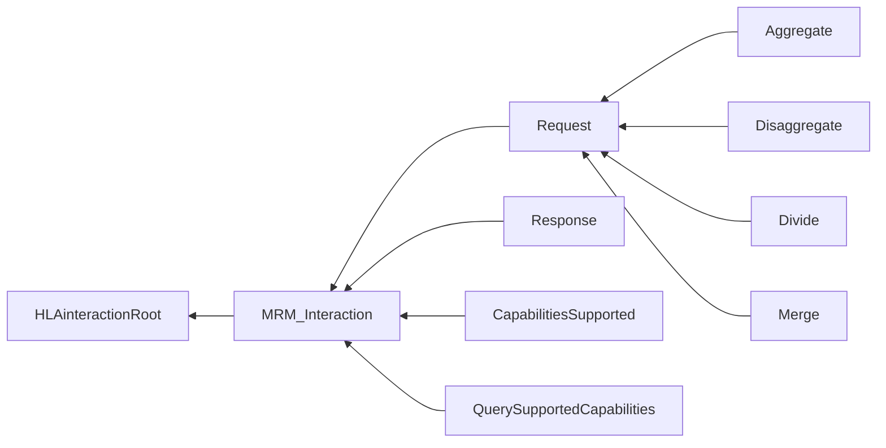

### MRM_Interaction

Base class for all MRM interactions.

|Parameter|Datatype|Semantics|
|---|---|---|
|EventId|UUID|Unique identifier for all MRM interactions belonging to the same request/respons event.|

### Request

A base class for all MRM  Request events to be performed on the specified AggregateEntity.

|Parameter|Datatype|Semantics|
|---|---|---|
|AggregateEntity|UUID|Required for all requests except QuerySupportedCapabilities. Unique identifier for the NETN_Aggregate for which this request is related to.|

### Aggregate

Instruction to the AggregateFederate to perform aggregation of the specified AggregateEntity's parts.

|Parameter|Datatype|Semantics|
|---|---|---|
|RemoveDisaggregatedEntities|HLAboolean|Optional. Indicates if the disaggregated entities of the referenced AggregateEntity should be deleted after aggregation or not. Default is TRUE - all disaggregated entities shall be deleted and the DisaggregatedEntities attribute is set to empty . If FALSE, the status of all disaggregated entities shall be set to inactive and the DisaggregatedEntities attribute of the AggregateEntity shall keep reference to all disaggregated entities.|

### Disaggregate

Instruction to perform a full disaggregation of an AggregatedEntity.

### Divide

Instruction to divide the simulated AggregateEntity into multiple simulated object.

|Parameter|Datatype|Semantics|
|---|---|---|
|Equipment|ArrayOfResourceStatus|Optional. Amount of equipment of different type and health status to be divided.|
|Personnel|ArrayOfResourceStatus|Optional. Amount of personnel of different type and health status to be divided.|
|Supplies|SupplyStructArray|Optional. Amount of supplies to divide.|
|RegisterPhysicalEntities|HLAboolean|Optional. If true all Equipment of type Platform and Lifeform are published as individual objects in the federation.|

### Merge

Instruction to merge the simulated AggregateEntity with specified divided entities.

|Parameter|Datatype|Semantics|
|---|---|---|
|DividedEntities|ArrayOfUuid|Required. A subset of identifiers from the DividedEntities attribute of the referenced AggregateEntity. The set of identifiers indicate which divided entities are to be merged back with the AggregateEntity.|

### Response

A response from the receiving federate indicating ability to comply with request.

|Parameter|Datatype|Semantics|
|---|---|---|
|Status|HLAboolean|Required. Specifies the result of the request action. TRUE indicates success.|

### CapabilitiesSupported

An interaction sent in respons to a QuerySupportedCapabilities request. The respons include a list of names of the supported capabilities for the AggregateEntity specified in the query. The names are one or more of "Aggregate", "Disaggregate", "Divide", "Merge", "Activate" and "Inactivate".

|Parameter|Datatype|Semantics|
|---|---|---|
|CapabilityNames|ArrayOfStringType|Required. A list of names of the supported capabilities for the Aggregate entity specified in the query. The names are one or more of "Aggregate", "Disaggregate", "Divide", "Merge", "Activate" and "Inactivate".|

### QuerySupportedCapabilities

A request to query the capabilities of a specified federate to provide support for MRM events. The queried federate shall respond with a CapabilitiesSupported interaction.

|Parameter|Datatype|Semantics|
|---|---|---|
|FederateApplication|UUID|Required: The federate to be queried.|

## Datatypes

Note that only datatypes defined in this FOM Module are listed below. Please refer to FOM Modules on which this module depends for other referenced datatypes.

### Overview
|Name|Semantics|
|---|---|
|ArrayOfEntityStruct|Data for one or more entities that comprise an entity list.|
|ArrayOfResourceStatus|The array of health states for a named resource.|
|ArrayOfSensorStruct|Array with definitio0ns of sensors, 1+ cardinality|
|CaptureStatusEnum8|The status of a simulated entity with respect to their control or influence over their own activities. Default: 1 - Not Captured.|
|ConcealmentEnum32|The reason for the objects concealment|
|ElectronicSignatureStruct|A summary percentage of an aggregates susceptibility to detection of its electronic emissions. Zero percent means that the aggregate has no electronic emissions.|
|EntityCategoryEnum32|Category of entity|
|EntityStruct|An entity represented to the federation as part of the aggregate object which owns it.|
|HUMINTSignatureStruct|Describes the entity susceptibility to human intelligence (HUMINT), i.e. information collected and provided by human sources.|
|MissionStruct|The operational task the aggregate has been ordered to perform, the time the mission was assigned, and the estimated completion time.|
|MountStruct|The current progress of the mounting of an entity.|
|RangeFloat32|Range of sensor|
|ResourceStatusNumberStruct|The name of a resource and the number of instances of that resource by health status.|
|SensorStateEnum32|The emission states of aggregate sensors|
|SensorStruct|Defines a sensor,operational status, damage status, coverage and ID|
|VisualSignatureStruct|Specifies the visual structure|
|WeaponControlOrderEnum8|The enumerations for weapon control|
        
### Simple Datatypes
|Name|Units|Semantics|
|---|---|---|
|RangeFloat32|meters|Range of sensor|
        
### Enumerated Datatypes
|Name|Representation|Semantics|
|---|---|---|
|CaptureStatusEnum8|HLAoctet|The status of a simulated entity with respect to their control or influence over their own activities. Default: 1 - Not Captured.|
|ConcealmentEnum32|RPRunsignedInteger32BE|The reason for the objects concealment|
|EntityCategoryEnum32|RPRunsignedInteger32BE|Category of entity|
|SensorStateEnum32|RPRunsignedInteger32BE|The emission states of aggregate sensors|
|WeaponControlOrderEnum8|HLAoctet|The enumerations for weapon control|
        
### Array Datatypes
|Name|Element Datatype|Semantics|
|---|---|---|
|ArrayOfEntityStruct|EntityStruct|Data for one or more entities that comprise an entity list.|
|ArrayOfResourceStatus|ResourceStatusNumberStruct|The array of health states for a named resource.|
|ArrayOfSensorStruct|SensorStruct|Array with definitio0ns of sensors, 1+ cardinality|
        
### Fixed Record Datatypes
|Name|Fields|Semantics|
|---|---|---|
|ElectronicSignatureStruct|ElectronicSignaturePercent, SensorArray|A summary percentage of an aggregates susceptibility to detection of its electronic emissions. Zero percent means that the aggregate has no electronic emissions.|
|EntityStruct|Callsign, EntityCategory, EntityStatus, IsDistinctObject, IsUnavailable, Facing, Concealment, OffsetLocation, Allocation|An entity represented to the federation as part of the aggregate object which owns it.|
|HUMINTSignatureStruct|HUMINTSignaturePercent|Describes the entity susceptibility to human intelligence (HUMINT), i.e. information collected and provided by human sources.|
|MissionStruct|StartTime, EndTime, MissionEnum|The operational task the aggregate has been ordered to perform, the time the mission was assigned, and the estimated completion time.|
|MountStruct|Entity, Progress|The current progress of the mounting of an entity.|
|ResourceStatusNumberStruct|NumberHealthyOrIntact, NumberSlightlyDamaged, NumberModeratelyDamaged, NumberSignificantlyDamaged, NumberDestroyed, ResourceName, ResourceType|The name of a resource and the number of instances of that resource by health status.|
|SensorStruct|SensorStateEnum, SensorDamageState, SensorCoverage, SensorID|Defines a sensor,operational status, damage status, coverage and ID|
|VisualSignatureStruct|DVOSignaturePercent, I2SignaturePercent, ThermalSignaturePercent|Specifies the visual structure|
    