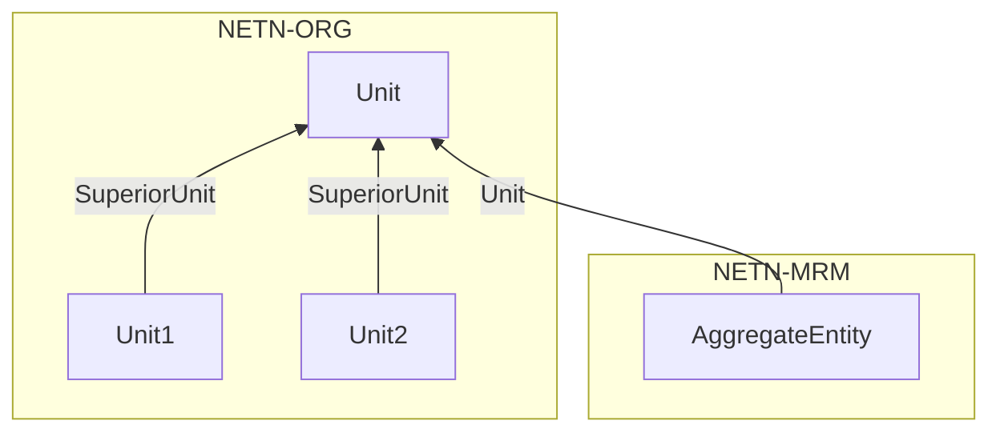
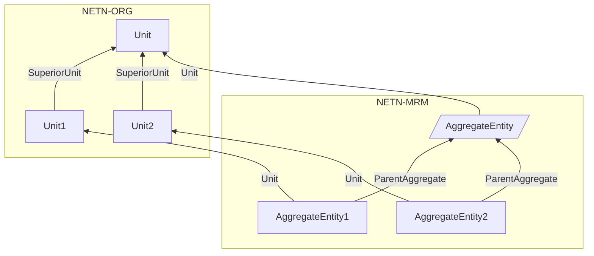
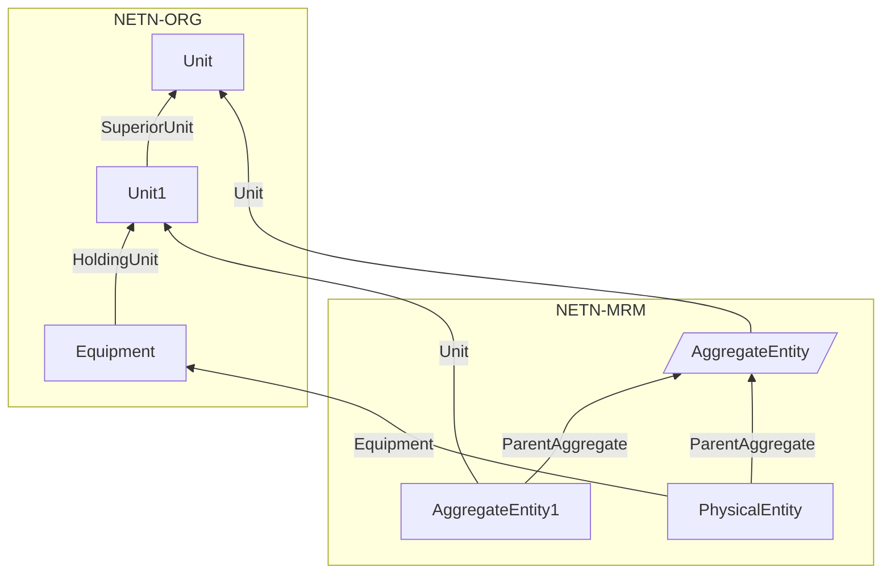
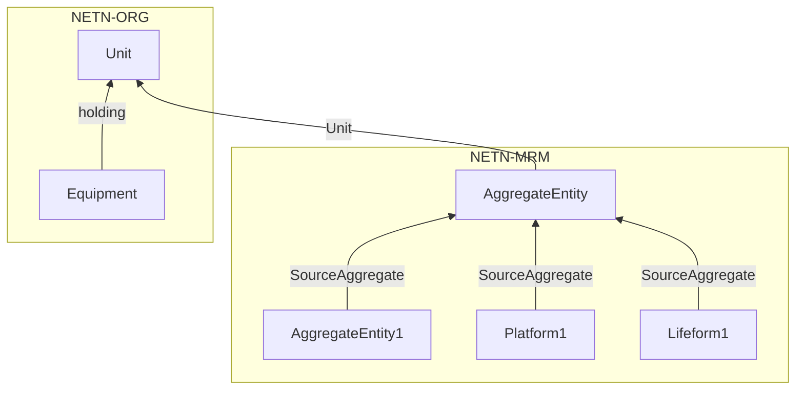
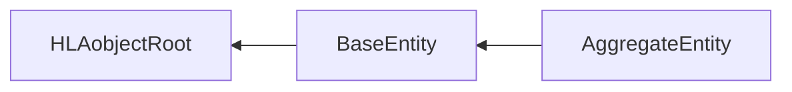
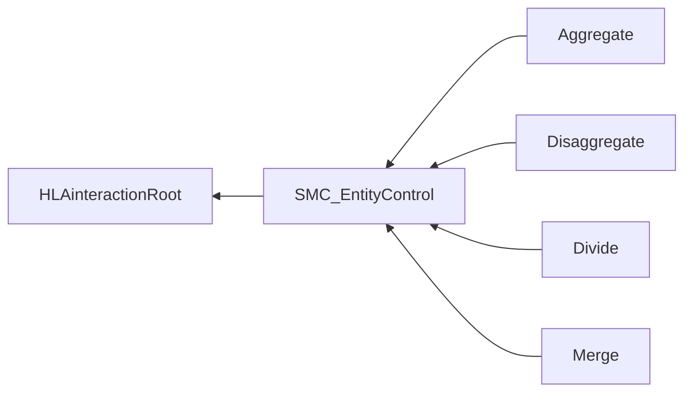

# NETN-MRM
|Version| Date| Dependencies|
|---|---|---|
|3.0|2023-11-19|NETN-BASE, NETN-SMC, NETN-ORG|

The purpose of NETN-MRM is to support federations with entities represented at multiple levels of resolution.

Models of real-world objects, processes and phenomena are used to create a synthetic representation suitable for the simulation. Entities can be represented as individual objects or as part of an aggregated object. Entity representation can change during the simulation and switch between different levels of aggregation and individual physical entities.  

The NATO Education and Training Network Multi-Resolution Modelling (NETN-MRM) FOM Module specifies aggregation, disaggregation, division and merging of aggregate entities.

NETN-MRM covers the following cases: 
* Aggregation of subunits into a representation of their parent unit
* Disaggregation of a unit representation into subunits
* Division of unit into subunits or physical entities
* Merging of previously divided entities into a unit

## Overview 
 
NETN-MRM extends the RPR-FOM `BaseEntity` and `AggregateEntity` object classes and defines `ETR_SimCon` interactions classes to trigger aggregation, disaggregation, division, and merge actions for aggregated entities. 
 
Implementing these MRM actions relies on knowledge of units' structure, organization, and equipment as defined in NETN-ORG. 
 
A NETN-ORG `Unit` can be represented in the federation as a single `AggregateEntity` object or as a collection of multiple `AggregateEntity` or `PhysicalEntity` objects. E.g. a `Unit` with associated `Equipment` in NETN-ORG can be represented as a combination of an `AggregateEntity` representing most of the unit and `Platform` entities to represent each platform equipment associated with the unit. 
 
The initial representation of units in the federation can change during runtime. For example, use the MRM actions to request aggregation and disaggregation or to split the entity by dividing holdings among multiple aggregate and physical entity objects. 
 
### Pattern 
 
All MRM actions use the same pattern of interaction. 
 
Use the `AggregateEntity` attribute `SupportedAggregationActions` to check the simulation entity's support for an MRM action. 
 
```mermaid 
sequenceDiagram 
autonumber 
 
Trigger->>AggregateEntity: Request 
note over AggregateEntity: Execute action 
AggregateEntity->>Federation: registerObjectInstance, <br>updateAttributeValues, <br>deleteObjectInstance 
AggregateEntity->>Trigger: Response 
``` 
 
 
1. A federate triggers an MRM action for a specified `AggregateEntity` using `ETR_SimCon` interaction subclasses 
2. The federate owning the `DisaggregatedEntities` attribute of the `AggregateEntity` is responsible for aggregation and disaggregation actions. The federate owning the `DividedEntities` attribute of the `AggregateEntity` is responsible for division and merging actions. Executing the action may include registering, deleting and updating objects in the federation. 
3. The federate then reports the success of the action using the `Response` interaction. 
 
 
### Disaggregation 
 
A federate application can perform disaggregation of an `AggregateEntity` under the following conditions: 
 

 
* The federate application owning the `DisaggregatedEntities` attribute of the `AggregateEntity` can perform disaggregation. 
* The `Status` of the `AggregateEntity` is `Active`. 
* The `AggregateEntity` has not been divided, i.e. the `DividedEntities` attribute must be empty. 
* The `AggregateEntity` attribute `OrganizationElement` refers to an existing NETN-ORG `Unit` object. 
* The NETN-ORG `Unit` object has one or more subunits. 
 
 
```mermaid 
sequenceDiagram 
autonumber 
 
Trigger->>AggregateEntity: Disaggregate(aggregate) 
AggregateEntity->>Federation: aggregate.updateAttributeValues(Status) 
loop 
AggregateEntity->>Federation: registerObjectInstance(entity) 
AggregateEntity->>Federation: entity.updateAttributeValues 
end 
AggregateEntity->>Federation: aggregate.updateAttributeValues(DisaggregatedEntities) 
AggregateEntity->>Trigger: Response 
 
``` 
 
1. A Request federate sends a `Disaggregate` request indicating which `AggregateEntity` to disaggregate. The Federate owning the `DisaggregatedEntities` attribute of the `AggregateEntity` is responsible for disaggregation. 
2. The Federate updates the `Status` of the `AggregateEntity` to `Inactive`. 
3. The Federate registers new `AggregateEntity` objects to represent the disaggregated entities. One instance for each of the subunits of the referenced `Unit`. 
4. The federate updates the initial attribute values for the new disaggregated entities, including the `ParentUnit` attribute to refer to the `AggregateEntity` and the `Status` to `Active`. 
5. The federate updates the `DisaggregatedEntities` attribute of the `AggregateEntity` object to reference the new disaggregated entities. 
6. On completion, the federate sends a `Response` interaction with the `Status` parameter set to indicate the successful completion of the request. 
 
After performing disaggregation, the following is true: 
 

 
* The `Status` of the `AggregateEntity` is `Inactive`. 
* New `AggregateEntity` objects exist for all subunits of the referenced NETN-ORG `Unit`. 
* Each new `AggregateEntity` refers to the corresponding subunit by its `OrganizationElement` attribute. 
* The `Status` of each new `AggregateEntity` is `Active`. 
* The `ParentAggregate` of each new `AggregateEntity` refers to the original disaggregated `AggregateEntity` 
* The `DisaggregsatedEntities` attribute of the disaggregated `AggregateEntity` reference all the new `AggregateEntity` objects 
 
If a subunit has one or more associated `Equipment` objects, then these are represented in the federation as `PhysicalEntity` objects. Each `PhysicalEntity` refers to the associated `Equipment` using the `OrganizationElement` attribute. In addition, the status of the `PhysicalEntity` is `Active`, and the `ParentAggregate` refers to the now disaggregated `AggregateEntity`. 
 

 
Disaggregation always constitutes a complete disaggregation of all subunits and associated equipment into active `AggregateEntity` or `PhysicalEntity` objects. The disaggregated `AggregateEntity` remains registered as `Inactive` in the federation. 
 
 
### Aggregation 
 
Aggregation of an `AggregateEntity` always constitutes a complete aggregation of all entities referenced by the `DisaggregatedEnties` attribute. 
 
A federate application can perform aggregation of an `AggregateEntity` under the following conditions: 
 
* The federate application owning the `DisaggregatedEntities` attribute of the `AggregateEntity` can perform aggregation. 
* The `Status` of the `AggregateEntity` is `Inctive`. 
* The `DividedEntities` attribute must be empty in all `AggregateEntity` objects referenced by the `DisaggregatedEntities` attribute, i.e. entities referencing the `AggregateEntity` using the `ParentAggregate` attribute are not divided. 
* The `DisaggregatedEntities` attribute must be empty in all `AggregateEntity` objects referenced by the `DisaggregatedEntities` attribute, i.e. entities referencing the `AggregateEntity` using the `ParentAggregate` attribute are not disaggregated. 
 
 
```mermaid 
sequenceDiagram 
autonumber 
 
Trigger->>AggregateEntity: Aggregate(aggregate) 
loop entity=aggregate.DisaggregatedEntities 
AggregateEntity->>Federation: entity.deleteObjectInstance 
end 
AggregateEntity->>Federation: aggregate.updateAttributeValues 
AggregateEntity->>Trigger: Response 
 
``` 
 
1. A federate sends an `Aggregate` trigger indicating which `AggregateEntity` to aggregate. Then, the Federate owning the `DisaggregatedEntities` attribute of the `AggregateEntity` performs the aggregation. 
2. The `AggregateEntity` federate deletes all entities referenced by the `DisaggregatedEntities` attribute 
3. The `AggregateEntity` federate updates all `AggregateEntity` attributes to reflect the current state, including the `Status` set to `Active`. 
4. On completion, the federate sends a `Response` interaction with the `Status` parameter set to indicate the successful completion of the request. 
 
 
### Division 
 
 
Division of an `AggregateEntity` is a temporary allocation of some specific resources to another `AggregateEntity` or into one or more `Platform` and `Lifeform` objects. 
 
A federate application can perform the division of an `AggregateEntity` under the following conditions: 
 
* The federate application owning the `DividedEntities` attribute of the `AggregateEntity` can perform division. 
* The `Status` of the `AggregateEntity` is `Active`. 
* The `AggregateEntity` has not been disaggregated, i.e. the `DisaggregatedEntities` attribute must be empty. 
 
 
```mermaid 
sequenceDiagram 
autonumber 
 
Trigger->>Federate: Divide(Resources, aggregate/physical) 
 
Federate->>Federation: registerObjectInstance(s) 
Federate->>Federation: updateAttributeValues 
Federate->>Federation: updateAttributeValues(DividedEntities) 
Federate->>Federation: updateAttributeValues(SourceAggregate) 
 
Federate->>Trigger: Response 
 
``` 
 
1. A Request federate sends a `Divide` interaction indicating the `AggregateEntity` to divide and the list of resources to reallocate to new entities. The request also indicates if resources should be allocated to a new `AggregateEntity` or as one or more physical `Platform` or `Lifeform` objects. The Federate owning the `DividedEntities` attribute of the `AggregateEntity` is responsible for performing the division. 
2. The federate registers either a new `AggregateEntity` or one or more `Platform` or `Lifeform` objects. 
3. The `AggregateEntity` and new entity are updated with the current status of allocated resources. 
4. The `AggregateEntity` is updated with the attribute `DividedEntities` referencing all newly created entities. 
5. All newly created entities are updated with the attribute `SourceAggregate` to refer to the `AggregateEntity`. 
6. On completion, the federate sends a `Response` interaction with the `Status` parameter set to indicate the successful completion of the request. 
 
After division, the following is true: 
 

 
* A new `AggregateEntity` object exists with a `SourceAggregate` attribute referencing the divided `AggregateEntity`, OR 
* One or more new `Platform` and `Lifeform` objects exist with the `SourceAggregate` attribute referencing the divided `AggregateEntity 
* The divided `AggregateEntity` references all new divided entities in the `DividedEntities` attribute. 
 
 
### Merging 
 
Merging of an `AggregateEntity` with one of its divided entities can be performed under the following conditions: 
 
* The federate application owning the `DividedEntities` attribute of the `AggregateEntity` can perform a merge. 
* The `Status` of the `AggregateEntity` is `Active`. 
* The `AggregateEntity` has been divided, i.e. the `DividedEntities` attribute must contain at least one element. 
 
 
```mermaid 
sequenceDiagram 
autonumber 
 
Trigger->>Federate: Merge(aggregate, dividedEntities) 
loop entity=dividedEntities 
Federate->>Federation: entity.deleteObjectInstance 
end 
Federate->>Federation: aggregate.updateAttributeValues(DividedEntities) 
Federate->>Federation: aggregate.updateAttributeValues 
Federate->>Trigger: Response 
 
``` 
 
1. A Request federate sends a `Merge` interaction indicating the `AggregateEntity` and the divided entities to merge. The Federate owning the `DividedEntities` attribute of the `AggregateEntity` performs the merge. 
2. The federate deletes all merged entities. 
3. Update the `AggregateEntity` attribute `DividedEntities` to exclude the divided entities now merged. 
4. Update the `AggregateEntity` attributes to reflect the merged status. 
5. On completion, the federate sends a `Response` interaction with the `Status` parameter set to indicate success or failure. 
 
After merging, the `AggregateEntity` representation includes all previously divided entities.


## Object Classes

Note that inherited and dependency attributes are not included in the description of object classes.



### BaseEntity

A base class of aggregate and discrete scenario domain participants. The BaseEntity class is characterized by being located at a particular location in space and independently movable, if capable of movement at all. It specifically excludes elements normally considered to be a component of another element. The BaseEntity class is intended to be a container for common attributes for entities of this type. Since it lacks sufficient class specific attributes that are required for simulation purposes, federates cannot publish objects of this class. Certain simulation management federates, e.g. viewers, may subscribe to this class. Simulation federates will normally subscribe to one of the subclasses, to gain the extra information required to properly simulate the entity.

|Attribute|Datatype|Semantics|
|---|---|---|
|Status|ActiveStatusEnum8|Optional. Indicates if this entity is currently being simulated or not. During an inactive state, the attribute values may not reflect accurate or current values. All attributes are updated to represent the current status of the object instance before setting the state to Active. The default is `Active`.|
|SourceAggregate|UUID|Optional. Reference to an active `AggregateEnity` instance which is the source of a NETN-MRM division. The default value is all zeros representing no source AggregateEntity.|
|ParentAggregate|UUID|Optional. If this simulation entity results from a disaggregation, this attribute refers to the disaggregated `AggregateEntity`. The default value is no reference, i.e. all zeros.|
|OrganizationElement|UUID|Optional: Reference to an existing NETN-ORG  organization element, e.g. a `Unit` or `Equipment` represented by this simulation entity. The default value is no related organization element, i.e. all zeros.|

### AggregateEntity

A group of one or more separate objects that operate together as part of an organization. These objects may be discrete, may be other aggregate objects, or may be a mixture of both.

|Attribute|Datatype|Semantics|
|---|---|---|
|DividedEntities|ArrayOfUuid|Optional. Reference to other aggregate or physical entities divided from the `AggregateEntity` to represent specific subsets of holdings.|
|DisaggregatedEntities|ArrayOfUuid|Optional. Reference to the disaggregated entities after disaggregation of this `AggregateEntity`. Each element should refer to an existing entity in the federation. The `Status` of this `AggregateEntity` shall be inactive if disaggregated entities exist.||

## Interaction Classes

Note that inherited and dependency parameters are not included in the description of interaction classes.



### SMC_EntityControl


### Aggregate

Instructs a federate application modelling the `AggregateEntity` to perform aggregation of the `DisaggregatedEntities`.


### Disaggregate

Instructs a federate application to disaggregate the indicated `AggregateEntity`.

|Parameter|Datatype|Semantics|
|---|---|---|
|Formation|FormationStruct|The formation of the disaggregated units.|

### Divide

Instructs a federate application to divide the `AggregateEntity` into multiple simulated entities.

|Parameter|Datatype|Semantics|
|---|---|---|
|Equipment|ArrayOfResourceStatus|Optional. Amount of equipment of different type and health status to be divided.|
|Personnel|ArrayOfResourceStatus|Optional. Amount of personnel of different type and health status to be divided.|
|Supplies|ArrayOfSupplyStatus|Optional. Amount of supplies to divide.|
|RegisterPhysicalEntities|HLAboolean|Optional. If true, all Equipment of type Platform and Lifeform are published as individual objects in the federation.|
|Formation|FormationStruct|The formation of the divided units.|

### Merge

Instructs a federate application to merge an `AggregateEntity` with divided entities.

|Parameter|Datatype|Semantics|
|---|---|---|
|DividedEntities|ArrayOfUuid|Required. A subset of identifiers from the DividedEntities attribute of the referenced AggregateEntity. The set of identifiers indicates which divided entities to merge with the AggregateEntity.|

## Datatypes

Note that only datatypes defined in this FOM Module are listed below. Please refer to FOM Modules on which this module depends for other referenced datatypes.

### Overview
|Name|Semantics|
|---|---|
|EntityControlActionEnum|Control actions for entities.|
        
### Enumerated Datatypes
|Name|Representation|Semantics|
|---|---|---|
|EntityControlActionEnum|HLAinteger32BE|Control actions for entities.|
    